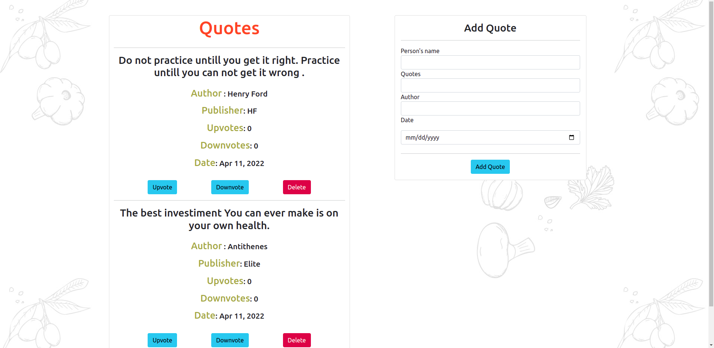

# QuotesPractice
## Description
An application where users can create quotes and have those quotes voted on whether they are terrible or are inspirational. 

## Table of contents
<ul>
    <li>Description</li>
    <li>Installation requirements</li>
    <li>Technology used</li>
    <li>Development</li>
    <li>Reference</li>
    <li>License</li>
    <li>Authors information</li>
    
</ul>

## Installation requirements
You don't need to install anything you only need internet connection

This project was generated with [Angular CLI](https://github.com/angular/angular-cli) version 13.3.1.

## Technologies used
<ul>
   <li>Angular</li>
   <li>CSS</li>
   <li>Typescript</li>
</ul>

## Development
  Want to contribute? Okay cool;follow the following steps:
<ul>
   <li>Fork the repo</li>
   <li>Create a new branch</li>
   <li>Make appropriate changes in the files</li>
   <li>Add changes to reflect the changes made</li>
   <li>Commit your changes</li>
   <li>Push to a Branch</li>
   <li>Create a Pull request</li>
</ul>

## Live site
here is a working live demo: [link](https://bonface221.github.io/Pizza-4-U/)

## Development server

Run `ng serve` for a dev server. Navigate to `http://localhost:4200/`. The application will automatically reload if you change any of the source files.

## Code scaffolding

Run `ng generate component component-name` to generate a new component. You can also use `ng generate directive|pipe|service|class|guard|interface|enum|module`.

## Build

Run `ng build` to build the project. The build artifacts will be stored in the `dist/` directory.

## Running unit tests

Run `ng test` to execute the unit tests via [Karma](https://karma-runner.github.io).

## Running end-to-end tests

Run `ng e2e` to execute the end-to-end tests via a platform of your choice. To use this command, you need to first add a package that implements end-to-end testing capabilities.

## license
[license](/LICENSE)

## Further help

To get more help on the Angular CLI use `ng help` or go check out the [Angular CLI Overview and Command Reference](https://angular.io/cli) page.
## Authors
@bonface221

